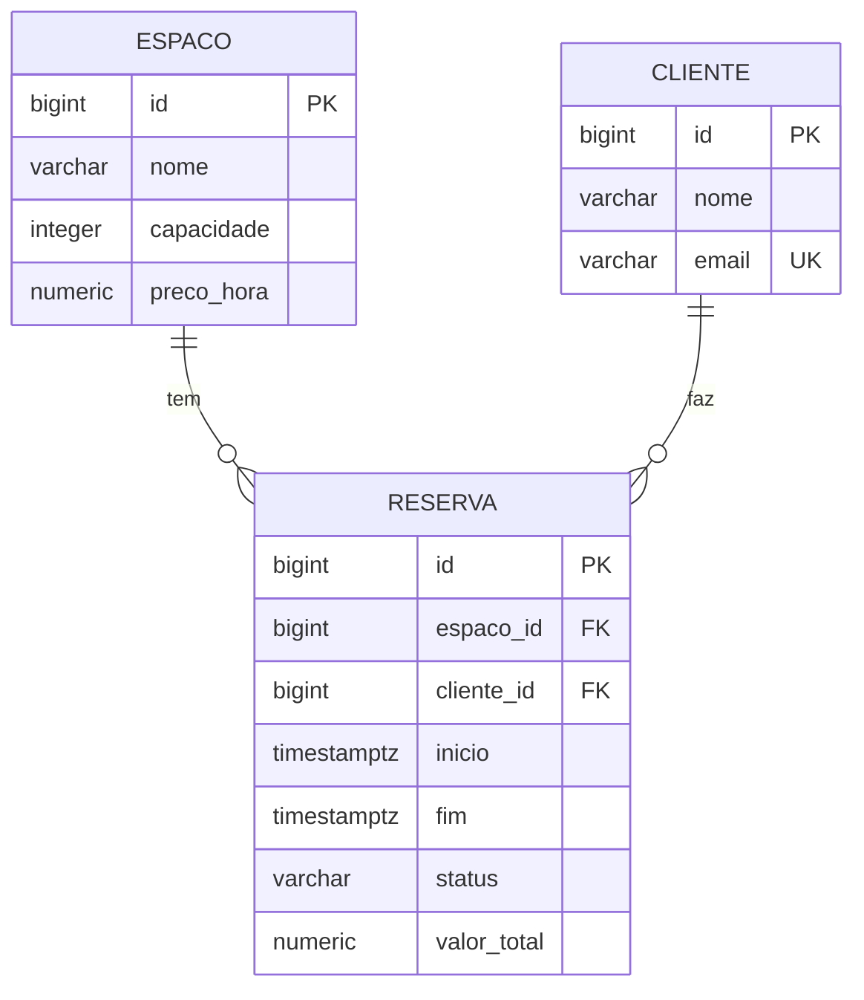

# reservar-api

[](https://github.com/furlanettoeduardo/reservar-api/actions/workflows/ci.yml)

API de locação de espaços para eventos. O problema central é evitar reserva dupla: duas
pessoas não podem ocupar o mesmo espaço em períodos que se sobrepõem — e detectar isso
corretamente envolve semântica de intervalo, concorrência e integridade no banco.

## Modelo



O relacionamento é **unidirecional**: só `Reserva` conhece `Espaco` e `Cliente`. As setas do
diagrama são a cardinalidade no banco, não navegação em Java — ver
[ADR 0001](docs/adr/0001-relacionamento-unidirecional.md).

## Como rodar

Pré-requisitos: JDK 21 e Docker.

```bash
docker compose up -d          # Postgres 18 em localhost:5432
./mvnw spring-boot:run
```

A aplicação sobe em `http://localhost:8080`. O Flyway aplica as migrations na subida, e
`ddl-auto: validate` derruba a aplicação se o mapeamento JPA divergir do schema.

- Swagger UI — <http://localhost:8080/swagger-ui.html>
- Health — <http://localhost:8080/actuator/health>

### Limitação: não há API para espaços e clientes

O 1A entrega apenas os endpoints de reserva. Criar espaço e cliente exige SQL direto — não
existe `POST /espacos` nem `POST /clientes`, e sem eles nenhuma requisição de reserva chega a
um `201`. É escopo deixado de fora conscientemente, não esquecimento: o objetivo do bloco era
a regra de sobreposição, não CRUD.

Consequência prática, para quem clonar: o passo abaixo é obrigatório antes do primeiro
`curl`. Resolver isso de verdade (dados de exemplo por perfil `dev`, de modo que
`docker compose up` já entregue um sistema navegável) está previsto para o 1C.

```bash
docker exec -i reservar-db psql -U reservas -d reservas <<'SQL'
INSERT INTO espaco (nome, capacidade, preco_hora) VALUES ('Sala Azul', 30, 150.00);
INSERT INTO cliente (nome, email) VALUES ('Ana Souza', 'ana@exemplo.com');
SQL
```

```bash
curl -i -X POST http://localhost:8080/reservas   -H 'Content-Type: application/json'   -d '{"espacoId":1,"clienteId":1,"inicio":"2026-09-01T13:00:00Z","fim":"2026-09-01T15:00:00Z"}'
```

Para ver o SQL gerado, suba com o perfil `dev`:

```bash
./mvnw spring-boot:run -Dspring-boot.run.profiles=dev
```

Para derrubar tudo, incluindo o volume de dados:

```bash
docker compose down -v
```

## Endpoints

| Método | Rota | Resposta |
|---|---|---|
| `POST` | `/reservas` | `201` + `Location`, ou `409` em conflito |
| `GET` | `/espacos/{espacoId}/reservas` | `200` com as reservas confirmadas |
| `POST` | `/reservas/{id}/cancelamento` | `204` |

Erros seguem [RFC 9457](https://www.rfc-editor.org/rfc/rfc9457) via `ProblemDetail`. Os dois
tipos de conflito são distinguidos pelo campo `type` e pela propriedade `detectadoPor`:
`"regra"` quando a verificação da aplicação pegou, `"constraint"` quando o banco pegou.

## Testes

```bash
./mvnw test      # unitários: domínio puro e fatia web mockada — segundos, sem Docker
./mvnw verify    # tudo, incluindo integração contra Postgres real via Testcontainers
```

A separação é Surefire (`*Tests`) versus Failsafe (`*IT`).

> **`./mvnw test` cobre 22 dos 48 testes.** Verde nele não significa verde no repositório —
> tudo que toca banco roda só no `verify`. Use `test` no loop de desenvolvimento e `verify`
> antes de abrir PR. O CI roda os dois.

| Camada | Testes | Tempo |
|---|---|---|
| Domínio puro | 14 | 0,11s |
| Fatia web (serviço mockado) | 8 | 1,2s |
| Persistência e repositório | 16 | ~0,9s |
| Serviço | 7 | 2,7s |
| Integração / medição | 3 | ~10s |

## Medição: o N+1 da listagem (antes)

`GET /espacos/{id}/reservas` com **50 reservas** dispara **52 queries**. Medido com
`hibernate.generate_statistics` e `Statistics.getPrepareStatementCount()`, não estimado —
ver `ContagemDeQueriesIT`.

A decomposição importa mais que o número:

| Origem | Queries |
|---|---|
| Listagem das reservas | 1 |
| `Espaco` (o mesmo para as 50 — 49 acertos no cache de 1º nível) | 1 |
| `Cliente` (50 distintos) | 50 |

**O N+1 escala com a cardinalidade dos alvos distintos, não com o tamanho da lista.** A
consequência prática é que um benchmark com dados pouco diversos mede o cache, não o N+1: um
teste com 50 reservas do mesmo cliente concluiria "2 queries" e a produção mostraria o
contrário. O cenário semeia 50 clientes distintos de propósito.

Mesma armadilha uma camada acima: a medição usa `@SpringBootTest` **sem** `@Transactional`.
Dentro da transação de um `@DataJpaTest`, os 50 clientes já estariam no persistence context e
a listagem devolveria 1 query — um "antes" falso, contra o qual qualquer correção pareceria
inútil.

Não corrigido de propósito. É a linha de base do Bloco 1B.

## Limitação conhecida: TOCTOU na verificação de sobreposição

`ReservaService.criar` verifica sobreposição e depois grava. Entre as duas coisas não há nada
segurando a linha. Sob `READ_COMMITTED` (default do Postgres), duas transações concorrentes
não enxergam a linha ainda não commitada uma da outra: ambas verificam, ambas veem livre,
ambas gravam.

Deliberado — a falha precisa ser medida com duas threads antes de ser corrigida, porque a
correção esconde a evidência. Candidatos, do mais forte ao mais fraco:

1. `EXCLUDE` constraint com `tstzrange` (V2) — a única que também protege escrita vinda de
   fora da aplicação: import manual, script de carga, um segundo serviço.
2. Lock pessimista no espaço.
3. `@Version` na reserva.

Lock otimista e pessimista defendem um caminho de código; constraint defende o dado.

## Decisões de arquitetura

- [ADR 0001 — Relacionamento unidirecional](docs/adr/0001-relacionamento-unidirecional.md)
- [ADR 0002 — JPQL em vez de query derivation](docs/adr/0002-jpql-em-vez-de-query-derivation.md)
- [ADR 0003 — `ListCrudRepository` em vez de `JpaRepository`](docs/adr/0003-listcrudrepository-em-vez-de-jparepository.md)

## Stack

Java 21 · Spring Boot 4.1 · Spring Data JPA (Hibernate 7.4) · PostgreSQL 18 · Flyway ·
Testcontainers · springdoc-openapi
