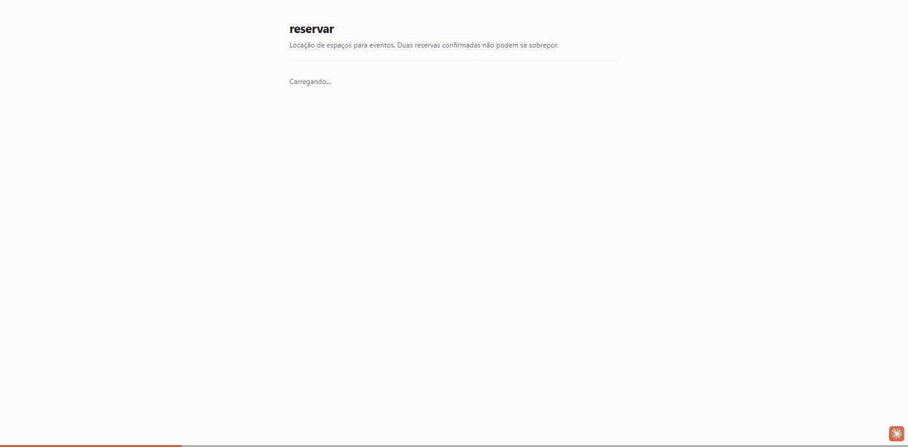
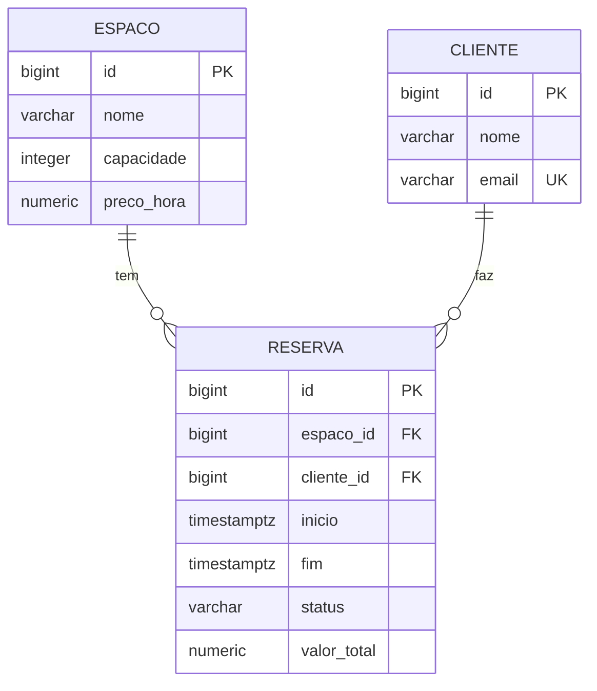

# reservar-api

[](https://github.com/furlanettoeduardo/reservar-api/actions/workflows/ci.yml)

API de locação de espaços para eventos. O problema central é evitar reserva dupla: duas pessoas
não podem ocupar o mesmo espaço em períodos que se sobrepõem — e detectar isso corretamente
envolve semântica de intervalo, concorrência e integridade no banco.



**Três números que resumem o que este repositório mede:**

- **52 → 1 query** na listagem de reservas, com as três correções de N+1 comparadas antes de
  escolher uma ([detalhes](docs/jpa-patologias.md#1-n1-na-listagem--52-queries-viraram-1))
- **TOCTOU reproduzido e fechado no banco** — duas transações concorrentes gravavam períodos
  sobrepostos; uma `EXCLUDE` constraint com `tstzrange` fechou a janela
- **0,204 ms contra 2,6 ms** — o índice B-tree medido contra o GiST da constraint, com
  `EXPLAIN ANALYZE` sobre 40.000 linhas

Nove patologias de JPA, Hibernate e transações reproduzidas em teste executável e documentadas
em [`docs/jpa-patologias.md`](docs/jpa-patologias.md).

## Modelo



O relacionamento é **unidirecional**: só `Reserva` conhece `Espaco` e `Cliente`. As setas do
diagrama são a cardinalidade no banco, não navegação em Java — ver
[ADR 0001](docs/adr/0001-relacionamento-unidirecional.md).

## Como rodar

Pré-requisitos: JDK 21 e Docker.

```bash
docker compose up -d          # Postgres 18 em localhost:5432
./mvnw spring-boot:run
```

A aplicação sobe em `http://localhost:8080`. O Flyway aplica as migrations na subida, e
`ddl-auto: validate` derruba a aplicação se o mapeamento JPA divergir do schema.

- Swagger UI — <http://localhost:8080/swagger-ui.html>
- Health — <http://localhost:8080/actuator/health>

### Limitação: espaços e clientes são somente leitura

Existem `GET /espacos` e `GET /clientes`, para a tela popular os selects e para quem usa a API
descobrir ids válidos. Não existe `POST` para nenhum dos dois: é escopo deixado de fora
conscientemente, não esquecimento — o objetivo do projeto é a regra de sobreposição, não CRUD.

Para ter o que reservar, suba com o perfil `dev`, que semeia dados de exemplo. Se preferir
semear à mão:

```bash
docker exec -i reservar-db psql -U reservas -d reservas <<'SQL'
INSERT INTO espaco (nome, capacidade, preco_hora) VALUES ('Sala Azul', 30, 150.00);
INSERT INTO cliente (nome, email) VALUES ('Ana Souza', 'ana@exemplo.com');
SQL
```

```bash
curl -i -X POST http://localhost:8080/reservas   -H 'Content-Type: application/json'   -d '{"espacoId":1,"clienteId":1,"inicio":"2026-09-01T13:00:00Z","fim":"2026-09-01T15:00:00Z"}'
```

Para ver o SQL gerado, suba com o perfil `dev`:

```bash
./mvnw spring-boot:run -Dspring-boot.run.profiles=dev
```

Para derrubar tudo, incluindo o volume de dados:

```bash
docker compose down -v
```

## A tela

Uma tela: listar as reservas de um espaço e criar uma nova. Sem login, sem rotas, sem design
system — ela existe para mostrar a regra de negócio funcionando, não para ser um frontend.

```bash
docker compose up -d
./mvnw spring-boot:run -Dspring-boot.run.profiles=dev   # semeia dados de exemplo

cd frontend && npm install && npm run dev               # http://localhost:5173
```

O perfil `dev` faz três coisas: liga o log de SQL, libera CORS para `localhost:5173` (origem
exata, não coringa) e semeia três espaços, três clientes e três reservas na primeira subida. É o
que resolve a limitação que o smoke test do 1A expôs — sem dados e sem endpoint de catálogo,
ninguém chegava a um `201`.

O que o GIF mostra é o caminho interessante: pedir um horário ocupado devolve `409` com o
`ProblemDetail` da RFC 9457, incluindo `detectadoPor: "regra"` — que distingue "a verificação da
aplicação barrou" de "o banco barrou". Trocar o horário por um livre devolve `201` com o valor
calculado pelo domínio.

Um detalhe que só apareceu olhando a tela: a tabela formata os horários no fuso do navegador e a
mensagem de erro vinha em UTC, então o usuário lia `11:00 - 13:00` na lista e `14:00:00Z` no
erro. A correção foi o servidor mandar o período em campos estruturados no `ProblemDetail`, e o
cliente formatar — a mensagem continua lá para quem consome a API sem interface.

## Endpoints

| Método | Rota | Resposta |
|---|---|---|
| `GET` | `/espacos` | `200` com o catálogo de espaços |
| `GET` | `/clientes` | `200` com o catálogo de clientes |
| `POST` | `/reservas` | `201` + `Location`, ou `409` em conflito |
| `GET` | `/espacos/{espacoId}/reservas` | `200` com as reservas confirmadas |
| `POST` | `/reservas/{id}/cancelamento` | `204` |

Erros seguem [RFC 9457](https://www.rfc-editor.org/rfc/rfc9457) via `ProblemDetail`. Os dois
tipos de conflito são distinguidos pelo campo `type` e pela propriedade `detectadoPor`:
`"regra"` quando a verificação da aplicação pegou, `"constraint"` quando o banco pegou.

## Testes

```bash
./mvnw test      # unitários: domínio puro e fatia web mockada — segundos, sem Docker
./mvnw verify    # tudo, incluindo integração contra Postgres real via Testcontainers
```

A separação é Surefire (`*Tests`) versus Failsafe (`*IT`).

> **`./mvnw test` cobre 22 dos 48 testes.** Verde nele não significa verde no repositório —
> tudo que toca banco roda só no `verify`. Use `test` no loop de desenvolvimento e `verify`
> antes de abrir PR. O CI roda os dois.

| Camada | Testes | Tempo |
|---|---|---|
| Domínio puro | 14 | 0,11s |
| Fatia web (serviço mockado) | 8 | 1,2s |
| Persistência e repositório | 16 | ~0,9s |
| Serviço | 7 | 2,7s |
| Integração / medição | 3 | ~10s |

## Medição: o N+1 da listagem, de 52 queries para 1

`GET /espacos/{id}/reservas` com 50 reservas custava **52 queries**. Medido com
`hibernate.generate_statistics` e `Statistics.getPrepareStatementCount()`, não estimado.

A decomposição importa mais que o número:

| Origem | Queries |
|---|---|
| Listagem das reservas | 1 |
| `Espaco` (o mesmo para as 50, com 49 acertos no cache de 1º nível) | 1 |
| `Cliente` (50 distintos) | 50 |

**O N+1 escala com a cardinalidade dos alvos distintos, não com o tamanho da lista.** Um
benchmark com dados pouco diversos mede o cache, não o N+1: um teste com 50 reservas do mesmo
cliente concluiria "2 queries" e a produção mostraria o contrário. O cenário semeia 50 clientes
distintos de propósito.

As três correções, medidas antes de escolher:

| Abordagem | Queries | Escopo | Elimina? |
|---|---|---|---|
| nenhuma | 52 | — | — |
| `join fetch` na JPQL | **1** | por consulta | sim |
| `@EntityGraph` | **1** | por consulta | sim |
| `default_batch_fetch_size = 25` | 4 | global | não, agrupa em lotes |

Adotado o `@EntityGraph`, por separação de responsabilidade: *o que selecionar* é semântica da
consulta, *o que carregar junto* é necessidade do caso de uso — com o graph a cláusula `where`
existe num lugar só e cada chamador escolhe seu plano. Custa o mesmo que `join fetch`, e há
teste comparando as duas contagens para deixar claro que a escolha é de organização de código.

`ContagemDeQueriesIT` trava a listagem em 1 com igualdade exata: se alguém remover o plano de
fetch, o build quebra. O caminho ingênuo continua medido em 52 em `CorrecaoNMaisUmIT`, para o
"antes" não virar folclore.

Detalhes em [`docs/jpa-patologias.md`](docs/jpa-patologias.md), incluindo por que o plano de
fetch saiu com `join` e não `left join`, e por que a armadilha de `join fetch` com paginação não
aparece aqui.

## Concorrência: TOCTOU medido e fechado no banco (1B)

`ReservaService.criar` verifica sobreposição e depois grava. Entre as duas coisas não há nada
segurando a linha: sob `READ_COMMITTED` (default do Postgres, conferido dentro do teste) a
segunda transação não enxerga a linha ainda não commitada da primeira, então ambas verificam,
ambas veem livre, e ambas gravam.

Reproduzido de forma determinística em `ConcorrenciaReservaIT`, com uma barreira que solta as
duas threads exatamente entre a verificação e a gravação:

| | rejeitadas | confirmadas | pares sobrepostos |
|---|---|---|---|
| antes da V2 | 0 | 2 | **1** — estado inválido gravado |
| depois da V2 | 1 | 1 | 0 |

A correção é a `V2`: uma `EXCLUDE` constraint com `tstzrange(inicio, fim, '[)')`, parcial em
`status = 'CONFIRMADA'`, replicando no banco a mesma semântica de intervalo meio-aberto que o
`Periodo` e a JPQL usam. Exige `btree_gist`, porque a constraint mistura `=` em `bigint` com
`&&` em intervalo e o GiST nativo não tem operator class para igualdade em tipo escalar.

**A verificação em Java continua perdendo a corrida, e isso é deliberado.** Ela é caminho
rápido — devolve `409` com mensagem útil no caso comum, sem tocar o banco duas vezes. A
constraint é a garantia, e vale também para import manual, script de carga ou um segundo
serviço, que nenhum lock em Java alcançaria.

### O banco recusa de duas formas, e só uma é forçável

| Escalonamento | Erro do Postgres | Exceção | Ramo | `detectadoPor` |
|---|---|---|---|---|
| Uma commita antes de a outra gravar | `exclusion_violation` | `DataIntegrityViolationException` | **Non**Transient | `constraint` |
| As duas gravam ao mesmo tempo | `deadlock detected` **ou** `exclusion_violation` | `CannotAcquireLockException` ou a de cima | Transient ou não | `deadlock` ou `constraint` |

O deadlock acontece porque cada `INSERT` grava a tupla e **depois** checa a exclusão: cada
transação encontra a tupla não-commitada da outra e espera por ela. É diferente de `UNIQUE` em
B-tree, onde o segundo insert bloqueia sem gravar e sai com violação limpa.

**Qual dos dois ocorre não é controlável.** O deadlock exige que ambos os `INSERT`s gravem a
tupla antes de qualquer um checar a exclusão, e essa janela é interna ao Postgres. A mesma
suíte deu deadlock três vezes seguidas em uma máquina e violação no runner do CI. Por isso
`ConcorrenciaReservaIT` assere o **invariante** — uma recusada, uma confirmada, zero pares
sobrepostos, e a recusa vindo do banco e não da regra — e apenas registra o mecanismo.

> Uma versão anterior assertava `CannotAcquireLockException` e passou três vezes localmente
> antes de quebrar no CI. Asserção sobre detalhe que o teste não controla é flakiness com outro
> nome, mesmo quando o teste é determinístico no resto.
>
> **Se as ITs só rodassem local, este erro estaria no `main`** e apareceria como "flaky, roda de
> novo" na primeira máquina diferente. É assim que teste de concorrência quebrado sobrevive
> anos: não é que ninguém testou, é que o teste era instável e todo mundo aprendeu a ignorar.

O handler captura a família `TransientDataAccessException`, não a subclasse específica. O ramo
da hierarquia do Spring **é** a informação: `Transient` significa "tentar de novo pode
funcionar" — e é o irmão de `NonTransientDataAccessException`, onde mora
`DataIntegrityViolationException`. As duas descendem de `DataAccessException` por caminhos
diferentes, então sem handler próprio o deadlock viraria `500`. Capturar a família cobre também
timeout de lock e falha de serialização, que produzem o mesmo `409` retentável.

Retry automático no serviço é candidato registrado e não implementado: mascararia a razão entre
os contadores de `detectadoPor`, que é a medida da janela de corrida.

## Índices: o B-tree não ficou redundante depois da `EXCLUDE`

A `EXCLUDE` da `V2` criou um índice GiST que aparentemente cobre a mesma consulta que
`idx_reserva_espaco_periodo`. Medido com 40.000 reservas em 200 espaços, `ANALYZE` antes:

| Predicado | Índices | Plano | Tempo | Buffers |
|---|---|---|---|---|
| escalar | B-tree + GiST | **Index Scan** | **0,204 ms** | **15** |
| escalar | só GiST | Seq Scan | 2,623 ms | 455 |
| intervalo (`&&`) | só GiST | Bitmap Heap Scan | 3,605 ms | 406 |
| escalar | nenhum | Seq Scan | 2,065 ms | 455 |

O GiST indexa a **expressão** `tstzrange(inicio, fim, '[)')`, e a consulta da regra usa
comparação escalar — que não casa com índice de expressão. Sem o B-tree, o planejador cai em Seq
Scan com o mesmo custo de não haver índice algum.

Reescrever o predicado como intervalo faz o GiST ser usado e fica **mais lento**: ele aplica só a
parte de intervalo, devolve 400 candidatos de todos os espaços e descarta 398 no heap. O B-tree
`(espaco_id, inicio, fim)` vai direto às 2 linhas.

Os dois índices ficam, com papéis distintos: o B-tree serve a leitura do caminho quente, o GiST
existe para a `EXCLUDE` funcionar. Detalhes e os planos completos em
[`docs/jpa-patologias.md`](docs/jpa-patologias.md).

## Armadilhas de `@Transactional`, verificadas em teste

`TransacaoIT` executa as duas patologias clássicas contra Postgres real. Cada uma tem um par
de controle que difere numa variável só, então o teste mostra a diferença em vez de afirmá-la.

**Autoinvocação.** `@Transactional` funciona por proxy: chamada que não sai do objeto não passa
pelo interceptor.

| Chamada | Transação ativa | Nome da transação |
|---|---|---|
| de fora (pelo proxy) | `true` | `...anotado` |
| `this.anotado()` | `false` | `null` |
| `this.observaEmTransacaoNova()` com `REQUIRES_NEW` | `true` | `...pedeTransacaoNovaViaThis` — a de **fora** |
| a mesma, pelo proxy | `true` | `...observaEmTransacaoNova` |

A consequência que custa dado: auditoria gravada em `REQUIRES_NEW` para sobreviver ao rollback
**some junto** quando chamada via `this`, porque nunca esteve numa transação separada. Mesmo
código, mesma anotação — só muda por onde a chamada passou.

**Rollback e checked exception.** O padrão do Spring só desfaz em `RuntimeException` e `Error`.

| Cenário | Linha gravada sobrevive? |
|---|---|
| `@Transactional` + checked propagada | **sim** — commitou apesar da falha |
| `@Transactional` + `RuntimeException` | não |
| `@Transactional(rollbackFor = ...)` + checked | não — a correção |
| checked capturada dentro do método | sim — e aqui está **correto** |

O último caso está no teste de propósito: sem ele, a leitura fácil é "checked exception é
perigosa", e alguém sai espalhando `rollbackFor` onde não há problema. O problema só existe
quando a exceção atravessa a fronteira transacional depois de algo já ter sido gravado.

Os métodos deliberadamente quebrados vivem em `PatologiasTransacionais`, em código de teste —
produção não carrega isso.

### Lock otimista: `V3`

O `UPDATE` do Hibernate reescreve todas as colunas em qualquer alteração, então duas edições de
campos **diferentes** da mesma linha se apagavam sem conflito lógico. Medido em três estados:

| | falhas | resultado |
|---|---|---|
| antes da `V3` | 0 | uma edição sobreviveu, a outra desapareceu **em silêncio** |
| depois da `V3` | 1 | uma edição sobreviveu, a outra foi **reportada** como conflito |
| `V3` + retry | 0 | **as duas** edições sobreviveram |

`@Version` não preserva as duas escritas — troca perda silenciosa por conflito reportado.
Preservar as duas é trabalho do retry.

## `equals`/`hashCode` de entidade JPA: as duas receitas erradas

As entidades usam `instanceof` no `equals` e uma constante de classe no `hashCode`. As duas
alternativas comuns falham, e falham de formas diferentes — ambas medidas em
`ContratoDeHashCodeTests` e `ProxyEmHashSetIT`:

| Receita | O que quebra |
|---|---|
| `hashCode` esquecido | **correção** — `contains` devolve `false`, sem nem chamar `equals` |
| `hashCode() = getClass().hashCode()` | **correção com proxy** — proxy e entidade vão para buckets diferentes |
| `hashCode` derivado do id | **correção no `persist`** — o id muda de `null` para um valor e a entidade some do `Set` |
| constante de classe (adotada) | **desempenho** — 2049 comparações por busca com n=4096 |

O preço não é acidente: identidade que muda ao longo do ciclo de vida do objeto é incompatível
com um `hashCode` estável e disperso ao mesmo tempo. A constante escolhe estabilidade.

E há um custo escondido medido: `contains(proxy)` dispara um `SELECT`, porque o `HashSet`
precisa do `hashCode` e o proxy só responde depois de inicializar. Coleção de entidades
inicializa proxies em silêncio.

Conclusão prática: coleção de **ids**, não de entidades. Detalhes em
[`docs/jpa-patologias.md`](docs/jpa-patologias.md).

## Arquitetura executável e cobertura de mutação

### ArchUnit: invariantes separados de descrições

As regras estão em dois arquivos, e a separação é o ponto:

| Arquivo | O que descreve | Na refatoração hexagonal |
|---|---|---|
| `InvariantesArquiteturaisTests` | verdades que valem antes e depois | **não deve quebrar** |
| `EstruturaAtualTests` | a estrutura de hoje, como linha de base | **deve quebrar** |

Sem essa separação, um build vermelho durante a refatoração tem duas leituras — "violei um
invariante" ou "a regra descrevia a estrutura antiga" — e a tentação é reescrever a regra para
acomodar o que foi feito. Aí o ArchUnit vira decoração.

Os invariantes: o domínio não conhece Spring, não depende de `web`/`service`/`repository`, só a
camada web toca HTTP, o controller não alcança o repositório direto, e ninguém usa `java.util.Date`.

A linha de base inclui o alvo da refatoração medido: hoje **exatamente** `Espaco`, `Cliente` e
`Reserva` dependem de `jakarta.persistence`, enquanto `Periodo` e `StatusReserva` já são livres de
framework. Quando o mapeamento virar adaptador, esse conjunto fica vazio e o teste falha — a
falha é o registro da mudança, como em `ConcorrenciaReservaIT` e `AtualizacaoPerdidaIT`.

**As regras foram testadas com dente.** Um `import org.springframework.util.Assert` numa classe de
domínio faz o build quebrar; sem ele, passa. `resideInAPackage("..domain..")` passa em silêncio se
o padrão estiver errado, então uma regra de arquitetura que nunca falhou não é regra.

E ela pegou algo na primeira execução: `CorsDeDesenvolvimento` estava no pacote `dev` e depende de
`org.springframework.web`. O perfil diz **quando** a classe está ativa; o pacote diz a **que
camada** ela pertence, e CORS é configuração de HTTP. A classe mudou de pacote.

### Pitest: o conjunto de mutadores importa mais que o score

Restrito ao domínio e rodando só contra `PeriodoTests` — o projeto inteiro levaria minutos, e os
ITs sobem Testcontainers, que o Pitest reexecutaria por mutante. Não roda no ciclo padrão:

```bash
./mvnw test-compile org.pitest:pitest-maven:mutationCoverage
```

| Classe | Mutantes | Mortos | Sem cobertura unitária | Sobreviveram |
|---|---|---|---|---|
| `Periodo` | 13 | **13** | 0 | 0 |
| `Espaco` | 53 | 13 | 38 | 2 |
| `Cliente` | 37 | 0 | 37 | 0 |
| `Reserva` | 53 | 0 | 53 | 0 |

Os 17% globais não são um sinal de qualidade: `Cliente` e `Reserva` aparecem inteiros como "sem
cobertura" porque quem os exercita são os ITs, que o Pitest não roda. O que o relatório diz de
útil é por classe.

**Os dois sobreviventes cobertos** são `MemberVariableMutator` removendo as atribuições de `nome` e
`capacidade` no construtor de `Espaco`. `PeriodoTests` só lê `precoHora`, então as outras
atribuições são inobserváveis ali — e é assim que deve ser: quem assere `nome` e `capacidade` é
`EspacoPersistenceIT`. Sobrevivente que não indica teste fraco, indica teste com escopo certo.

### O achado: o mutador que não existe

O conjunto **padrão** do Pitest gerava **um** mutante em `calcularValor` (retornar `null`).
Aritmética de `BigDecimal` é chamada de método, não opcode, então os mutadores aritméticos não
disparam. Com `ALL`, aparecem doze — incluindo `BigDecimalMutator`, que troca `multiply` por
`divide`. Num domínio que calcula dinheiro, o conjunto padrão é cego justamente onde os bugs
moram.

Mas mesmo com `ALL`, **nenhum mutante altera o `RoundingMode`** — não existe mutador para
constante de enum. Então os 12 mutantes mortos em `calcularValor` não atestam nada sobre
`HALF_UP`.

E o vazio era real. Os casos que já existiam não discriminavam: 100,00/h por 10 min dá
16,6666…, e `HALF_UP`, `HALF_DOWN` e `HALF_EVEN` concordam em 16,67, porque o dígito descartado é
6 e não 5. Precisava de uma metade exata:

| 33,33/h por 30 min | = 16,665 exato |
|---|---|
| `HALF_UP` | **16,67** |
| `HALF_DOWN` | 16,66 |
| `HALF_EVEN` | 16,66 |

Com o teste novo, mutar `HALF_UP` para `HALF_DOWN` ou `HALF_EVEN` à mão faz falhar exatamente um
teste — o novo. Antes dele, nenhum.

> **O teste que fechou o vazio moveu o score de mutação em exatamente zero:** 156 mutantes, 26
> mortos, antes e depois. Cobertura de mutação só atesta o que o conjunto de mutadores consegue
> expressar, e perseguir o número teria escondido o vazio em vez de revelá-lo.

## Patologias medidas

O documento [`docs/jpa-patologias.md`](docs/jpa-patologias.md) reúne cada patologia de JPA,
Hibernate e transações reproduzida neste repositório — com o mecanismo, o teste que a prova, o
número medido, e a correção ou o motivo de não haver uma. Inclui dois padrões sobre como
correções falham: mover a falha para outra camada e mover a falha para outro ambiente.

## Decisões de arquitetura

- [ADR 0001 — Relacionamento unidirecional](docs/adr/0001-relacionamento-unidirecional.md)
- [ADR 0002 — JPQL em vez de query derivation](docs/adr/0002-jpql-em-vez-de-query-derivation.md)
- [ADR 0003 — `ListCrudRepository` em vez de `JpaRepository`](docs/adr/0003-listcrudrepository-em-vez-de-jparepository.md)

## Stack

Java 21 · Spring Boot 4.1 · Spring Data JPA (Hibernate 7.4) · PostgreSQL 18 · Flyway ·
Testcontainers · springdoc-openapi
