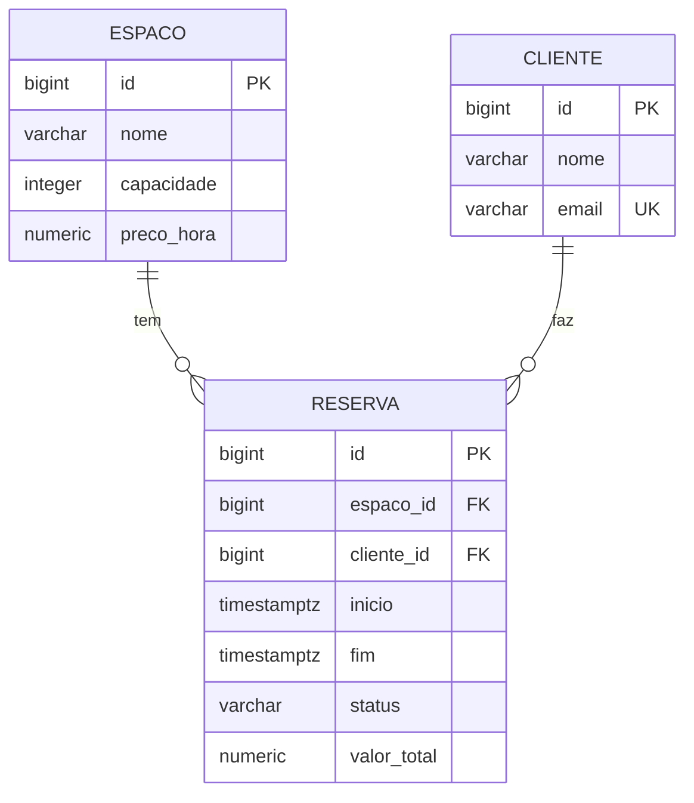

# reservar-api

[](https://github.com/furlanettoeduardo/reservar-api/actions/workflows/ci.yml)

API de locação de espaços para eventos. O problema central é evitar reserva dupla: duas
pessoas não podem ocupar o mesmo espaço em períodos que se sobrepõem — e detectar isso
corretamente envolve semântica de intervalo, concorrência e integridade no banco.

## Modelo



O relacionamento é **unidirecional**: só `Reserva` conhece `Espaco` e `Cliente`. As setas do
diagrama são a cardinalidade no banco, não navegação em Java — ver
[ADR 0001](docs/adr/0001-relacionamento-unidirecional.md).

## Como rodar

Pré-requisitos: JDK 21 e Docker.

```bash
docker compose up -d          # Postgres 18 em localhost:5432
./mvnw spring-boot:run
```

A aplicação sobe em `http://localhost:8080`. O Flyway aplica as migrations na subida, e
`ddl-auto: validate` derruba a aplicação se o mapeamento JPA divergir do schema.

- Swagger UI — <http://localhost:8080/swagger-ui.html>
- Health — <http://localhost:8080/actuator/health>

### Limitação: não há API para espaços e clientes

O 1A entrega apenas os endpoints de reserva. Criar espaço e cliente exige SQL direto — não
existe `POST /espacos` nem `POST /clientes`, e sem eles nenhuma requisição de reserva chega a
um `201`. É escopo deixado de fora conscientemente, não esquecimento: o objetivo do bloco era
a regra de sobreposição, não CRUD.

Consequência prática, para quem clonar: o passo abaixo é obrigatório antes do primeiro
`curl`. Resolver isso de verdade (dados de exemplo por perfil `dev`, de modo que
`docker compose up` já entregue um sistema navegável) está previsto para o 1C.

```bash
docker exec -i reservar-db psql -U reservas -d reservas <<'SQL'
INSERT INTO espaco (nome, capacidade, preco_hora) VALUES ('Sala Azul', 30, 150.00);
INSERT INTO cliente (nome, email) VALUES ('Ana Souza', 'ana@exemplo.com');
SQL
```

```bash
curl -i -X POST http://localhost:8080/reservas   -H 'Content-Type: application/json'   -d '{"espacoId":1,"clienteId":1,"inicio":"2026-09-01T13:00:00Z","fim":"2026-09-01T15:00:00Z"}'
```

Para ver o SQL gerado, suba com o perfil `dev`:

```bash
./mvnw spring-boot:run -Dspring-boot.run.profiles=dev
```

Para derrubar tudo, incluindo o volume de dados:

```bash
docker compose down -v
```

## Endpoints

| Método | Rota | Resposta |
|---|---|---|
| `POST` | `/reservas` | `201` + `Location`, ou `409` em conflito |
| `GET` | `/espacos/{espacoId}/reservas` | `200` com as reservas confirmadas |
| `POST` | `/reservas/{id}/cancelamento` | `204` |

Erros seguem [RFC 9457](https://www.rfc-editor.org/rfc/rfc9457) via `ProblemDetail`. Os dois
tipos de conflito são distinguidos pelo campo `type` e pela propriedade `detectadoPor`:
`"regra"` quando a verificação da aplicação pegou, `"constraint"` quando o banco pegou.

## Testes

```bash
./mvnw test      # unitários: domínio puro e fatia web mockada — segundos, sem Docker
./mvnw verify    # tudo, incluindo integração contra Postgres real via Testcontainers
```

A separação é Surefire (`*Tests`) versus Failsafe (`*IT`).

> **`./mvnw test` cobre 22 dos 48 testes.** Verde nele não significa verde no repositório —
> tudo que toca banco roda só no `verify`. Use `test` no loop de desenvolvimento e `verify`
> antes de abrir PR. O CI roda os dois.

| Camada | Testes | Tempo |
|---|---|---|
| Domínio puro | 14 | 0,11s |
| Fatia web (serviço mockado) | 8 | 1,2s |
| Persistência e repositório | 16 | ~0,9s |
| Serviço | 7 | 2,7s |
| Integração / medição | 3 | ~10s |

## Medição: o N+1 da listagem (antes)

`GET /espacos/{id}/reservas` com **50 reservas** dispara **52 queries**. Medido com
`hibernate.generate_statistics` e `Statistics.getPrepareStatementCount()`, não estimado —
ver `ContagemDeQueriesIT`.

A decomposição importa mais que o número:

| Origem | Queries |
|---|---|
| Listagem das reservas | 1 |
| `Espaco` (o mesmo para as 50 — 49 acertos no cache de 1º nível) | 1 |
| `Cliente` (50 distintos) | 50 |

**O N+1 escala com a cardinalidade dos alvos distintos, não com o tamanho da lista.** A
consequência prática é que um benchmark com dados pouco diversos mede o cache, não o N+1: um
teste com 50 reservas do mesmo cliente concluiria "2 queries" e a produção mostraria o
contrário. O cenário semeia 50 clientes distintos de propósito.

Mesma armadilha uma camada acima: a medição usa `@SpringBootTest` **sem** `@Transactional`.
Dentro da transação de um `@DataJpaTest`, os 50 clientes já estariam no persistence context e
a listagem devolveria 1 query — um "antes" falso, contra o qual qualquer correção pareceria
inútil.

Não corrigido de propósito. É a linha de base do Bloco 1B.

## Concorrência: TOCTOU medido e fechado no banco (1B)

`ReservaService.criar` verifica sobreposição e depois grava. Entre as duas coisas não há nada
segurando a linha: sob `READ_COMMITTED` (default do Postgres, conferido dentro do teste) a
segunda transação não enxerga a linha ainda não commitada da primeira, então ambas verificam,
ambas veem livre, e ambas gravam.

Reproduzido de forma determinística em `ConcorrenciaReservaIT`, com uma barreira que solta as
duas threads exatamente entre a verificação e a gravação:

| | rejeitadas | confirmadas | pares sobrepostos |
|---|---|---|---|
| antes da V2 | 0 | 2 | **1** — estado inválido gravado |
| depois da V2 | 1 | 1 | 0 |

A correção é a `V2`: uma `EXCLUDE` constraint com `tstzrange(inicio, fim, '[)')`, parcial em
`status = 'CONFIRMADA'`, replicando no banco a mesma semântica de intervalo meio-aberto que o
`Periodo` e a JPQL usam. Exige `btree_gist`, porque a constraint mistura `=` em `bigint` com
`&&` em intervalo e o GiST nativo não tem operator class para igualdade em tipo escalar.

**A verificação em Java continua perdendo a corrida, e isso é deliberado.** Ela é caminho
rápido — devolve `409` com mensagem útil no caso comum, sem tocar o banco duas vezes. A
constraint é a garantia, e vale também para import manual, script de carga ou um segundo
serviço, que nenhum lock em Java alcançaria.

### O banco recusa de duas formas, e só uma é forçável

| Escalonamento | Erro do Postgres | Exceção | Ramo | `detectadoPor` |
|---|---|---|---|---|
| Uma commita antes de a outra gravar | `exclusion_violation` | `DataIntegrityViolationException` | **Non**Transient | `constraint` |
| As duas gravam ao mesmo tempo | `deadlock detected` **ou** `exclusion_violation` | `CannotAcquireLockException` ou a de cima | Transient ou não | `deadlock` ou `constraint` |

O deadlock acontece porque cada `INSERT` grava a tupla e **depois** checa a exclusão: cada
transação encontra a tupla não-commitada da outra e espera por ela. É diferente de `UNIQUE` em
B-tree, onde o segundo insert bloqueia sem gravar e sai com violação limpa.

**Qual dos dois ocorre não é controlável.** O deadlock exige que ambos os `INSERT`s gravem a
tupla antes de qualquer um checar a exclusão, e essa janela é interna ao Postgres. A mesma
suíte deu deadlock três vezes seguidas em uma máquina e violação no runner do CI. Por isso
`ConcorrenciaReservaIT` assere o **invariante** — uma recusada, uma confirmada, zero pares
sobrepostos, e a recusa vindo do banco e não da regra — e apenas registra o mecanismo.

> Uma versão anterior assertava `CannotAcquireLockException` e passou três vezes localmente
> antes de quebrar no CI. Asserção sobre detalhe que o teste não controla é flakiness com outro
> nome, mesmo quando o teste é determinístico no resto.
>
> **Se as ITs só rodassem local, este erro estaria no `main`** e apareceria como "flaky, roda de
> novo" na primeira máquina diferente. É assim que teste de concorrência quebrado sobrevive
> anos: não é que ninguém testou, é que o teste era instável e todo mundo aprendeu a ignorar.

O handler captura a família `TransientDataAccessException`, não a subclasse específica. O ramo
da hierarquia do Spring **é** a informação: `Transient` significa "tentar de novo pode
funcionar" — e é o irmão de `NonTransientDataAccessException`, onde mora
`DataIntegrityViolationException`. As duas descendem de `DataAccessException` por caminhos
diferentes, então sem handler próprio o deadlock viraria `500`. Capturar a família cobre também
timeout de lock e falha de serialização, que produzem o mesmo `409` retentável.

Retry automático no serviço é candidato registrado e não implementado: mascararia a razão entre
os contadores de `detectadoPor`, que é a medida da janela de corrida.

## Armadilhas de `@Transactional`, verificadas em teste

`TransacaoIT` executa as duas patologias clássicas contra Postgres real. Cada uma tem um par
de controle que difere numa variável só, então o teste mostra a diferença em vez de afirmá-la.

**Autoinvocação.** `@Transactional` funciona por proxy: chamada que não sai do objeto não passa
pelo interceptor.

| Chamada | Transação ativa | Nome da transação |
|---|---|---|
| de fora (pelo proxy) | `true` | `...anotado` |
| `this.anotado()` | `false` | `null` |
| `this.observaEmTransacaoNova()` com `REQUIRES_NEW` | `true` | `...pedeTransacaoNovaViaThis` — a de **fora** |
| a mesma, pelo proxy | `true` | `...observaEmTransacaoNova` |

A consequência que custa dado: auditoria gravada em `REQUIRES_NEW` para sobreviver ao rollback
**some junto** quando chamada via `this`, porque nunca esteve numa transação separada. Mesmo
código, mesma anotação — só muda por onde a chamada passou.

**Rollback e checked exception.** O padrão do Spring só desfaz em `RuntimeException` e `Error`.

| Cenário | Linha gravada sobrevive? |
|---|---|
| `@Transactional` + checked propagada | **sim** — commitou apesar da falha |
| `@Transactional` + `RuntimeException` | não |
| `@Transactional(rollbackFor = ...)` + checked | não — a correção |
| checked capturada dentro do método | sim — e aqui está **correto** |

O último caso está no teste de propósito: sem ele, a leitura fácil é "checked exception é
perigosa", e alguém sai espalhando `rollbackFor` onde não há problema. O problema só existe
quando a exceção atravessa a fronteira transacional depois de algo já ter sido gravado.

Os métodos deliberadamente quebrados vivem em `PatologiasTransacionais`, em código de teste —
produção não carrega isso.

## Patologias medidas

O documento [`docs/jpa-patologias.md`](docs/jpa-patologias.md) reúne cada patologia de JPA,
Hibernate e transações reproduzida neste repositório — com o mecanismo, o teste que a prova, o
número medido, e a correção ou o motivo de não haver uma. Inclui dois padrões sobre como
correções falham: mover a falha para outra camada e mover a falha para outro ambiente.

## Decisões de arquitetura

- [ADR 0001 — Relacionamento unidirecional](docs/adr/0001-relacionamento-unidirecional.md)
- [ADR 0002 — JPQL em vez de query derivation](docs/adr/0002-jpql-em-vez-de-query-derivation.md)
- [ADR 0003 — `ListCrudRepository` em vez de `JpaRepository`](docs/adr/0003-listcrudrepository-em-vez-de-jparepository.md)

## Stack

Java 21 · Spring Boot 4.1 · Spring Data JPA (Hibernate 7.4) · PostgreSQL 18 · Flyway ·
Testcontainers · springdoc-openapi
